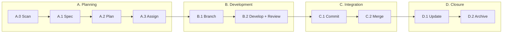

[English](README.md) | [中文](README.zh.md) | **日本語** | [한국어](README.ko.md)

<!-- translated-from: v1.68.1 -->

# Aria

> AIをソフトウェアプロジェクトの真のコラボレーターに

[](https://opensource.org/licenses/MIT)
[](https://github.com/10CG/aria-plugin)

---

## Aria とは?

Aria は **AI-DDD（AI支援ドメイン駆動設計）方法論**です。Claude Code のような AI アシスタントが、構造化されたワークフローを通じてソフトウェア開発ライフサイクル全体に深く参加できるようにします。

従来の「AIがコードを書く」ツールとは異なり、Aria は次の点に焦点を当てます: **どうすれば AI にプロジェクトの意図を理解させ、価値あるコラボレーターにできるか**。

| 従来モード | Aria モード |
|-----------------|-----------|
| AI はツール — あなたが尋ね、AI が答える | AI はコラボレーター — AI が理解し、あなたが確認し、共に成果を届ける |

**Aria 2.0（v2.0.0、進行中）** は、この方法論を自律実行へと拡張します。2 層アーキテクチャについては [docs/architecture/system-architecture.md](docs/architecture/system-architecture.md) を参照してください。

---

## なぜ Aria か?

### 課題

- AI の提案がプロジェクトの慣習に従わない
- セッションのたびにプロジェクトのコンテキストを説明し直す
- コードとドキュメントが乖離していく
- 要件変更に監査証跡が残らない

### 解決策

| 機能 | 説明 |
|---------|-------------|
| **状態認識** | AI がプロジェクトを自動スキャンし、現在の進捗を理解する |
| **仕様ファースト** | OpenSpec が要件記述を標準化する |
| **十ステップサイクル** | 構造化された AI コラボレーションのワークフロー |
| **ドキュメント同期** | アーキテクチャドキュメントがコードと共に進化する |
| **TDD 駆動** | 強制力を伴うテストファースト開発 |
| **協調的思考** | AI が参加する構造化ブレインストーミング |

ロードマップと自律実行のビジョンについては [Aria 2.0 PRD](docs/requirements/prd-aria-v2.md) を参照してください。

---

## クイックスタート

### 前提条件

- [Claude Code](https://claude.ai/code) がインストール済みで認証完了していること
- Git 2.x+（standards サブモジュールを使用する場合）

### Aria Plugin のインストール

```bash
# Add marketplace
/plugin marketplace add 10CG/aria-plugin

# Install (Skills + Agents included)
/plugin install aria@10CG-aria-plugin
```

### Standards のインストール（任意）

standards サブモジュールは OpenSpec の要件仕様を提供します。仕様駆動のワークフローが不要であれば、これはスキップして構いません。

```bash
# HTTPS
git submodule add https://github.com/10CG/aria-standards.git standards

# Or SSH
git submodule add git@github.com:10CG/aria-standards.git standards
```

### プロジェクトの設定

テンプレートから `.aria/config.json` を作成するか、単純に Aria を使い始めます:

```bash
# Scan project status
/aria:state-scanner

# Create a requirement spec
/aria:spec-drafter

# Structured brainstorming
/aria:brainstorm

# Call a specialized agent
/aria:tech-lead Please plan the architecture for this feature
```

---

## 仕組み: 十ステップサイクル



各フェーズには専用の Skill があり、一貫した再現可能なワークフローを保証します:

| フェーズ | 内容 |
|-------|-------------|
| **A. Planning** | プロジェクト状態をスキャン → 仕様を作成 → タスクに分解 → エージェントを割り当て |
| **B. Development** | ブランチを作成 → TDD + コードレビューで開発 |
| **C. Integration** | コミットメッセージを生成 → main へマージ |
| **D. Closure** | 進捗を更新 → 仕様をアーカイブ |

---

## 得られるもの

### Skills（ユーザー向け 35 + 内部 7 = 合計 42）

| カテゴリ | Skills | 目的 |
|----------|--------|---------|
| **サイクルコア** | state-scanner, workflow-runner, phase-a-planner, phase-b-developer, phase-c-integrator, phase-d-closer, spec-drafter, task-planner, progress-updater | 構造化された十ステップワークフロー |
| **協調的思考** | brainstorm | 構造化ブレインストーミングのセッション |
| **Git ワークフロー** | commit-msg-generator, strategic-commit-orchestrator, branch-manager, branch-finisher | コミットとブランチの管理 |
| **開発ツール** | subagent-driver, tdd-enforcer, requesting-code-review | TDD の強制、コードレビュー |
| **アーキテクチャドキュメント** | arch-search, arch-update, arch-scaffolder, api-doc-generator | ドキュメントをコードと同期させる |
| **要件 & Issue** | requirements-validator, requirements-sync, forgejo-sync, openspec-archive, issue-triage | 要件追跡と Issue トリアージ |
| **プロジェクト適応** | project-analyzer, agent-gap-analyzer, agent-creator | プロジェクト分析、Agent の不足把握、設定生成 |
| **可観測性 & 見積もり** | aria-context-monitor, ai-native-estimator, aria-dashboard | コンテキスト/トークンのテレメトリ、工数見積もり、進捗の可視化 |
| **フィードバック & 診断** | aria-report, aria-doctor | バグ報告と環境ヘルスチェック |
| **インフラ** *(内部 7、ユーザー呼び出し不可)* | config-loader, audit-engine, agent-team-audit, agent-router, arch-common, git-remote-helper, aria-token-telemetry | 設定、監査オーケストレーション、タスクルーティング、共有インフラ |

### Agents（11）

| Agent | 役割 |
|-------|------|
| tech-lead | 技術的判断とアーキテクチャ計画 |
| context-manager | エージェント横断のコンテキスト管理 |
| knowledge-manager | ナレッジベース管理 |
| code-reviewer | コードレビュー |
| backend-architect | バックエンドアーキテクチャ設計 |
| mobile-developer | モバイル開発 |
| qa-engineer | 品質保証 |
| ai-engineer | AI/LLM アプリケーション開発 |
| api-documenter | API ドキュメント |
| ui-ux-designer | インターフェース設計 |
| legal-advisor | 法務・コンプライアンス文書 |

---

## ユースケース

| シナリオ | Aria がどう役立つか |
|----------|---------------|
| 新機能 | 要件からコードまでのエンドツーエンドの流れ |
| バグ修正 | TDD 駆動の修正ワークフロー |
| リファクタリング | アーキテクチャドキュメントを同期させたコードの進化 |
| コードレビュー | 慣習遵守の自動チェック |
| ナレッジ移転 | 新メンバーがプロジェクトを素早く理解する手助け |
| 技術的判断 | 構造化ブレインストーミングとソリューション設計 |

---

## OpenSpec: 要件仕様

AI と人間が「何を作るか」で合意するための、標準化された要件記述フォーマット:

| Level | 使用する場面 | 成果物 |
|-------|-------------|--------|
| 1 (Skip) | 単純な修正 | 仕様不要 |
| 2 (Minimal) | 中規模の機能 | `proposal.md` |
| 3 (Full) | アーキテクチャ変更 | `proposal.md` + `tasks.md` |

Aria plugin は、プロジェクトのルートディレクトリにある `openspec/changes/`（`standards/` の内部ではない）から仕様を読み込みます。`standards` サブモジュールは、プラグインが参照する方法論の定義を提供します。

---

## プロジェクト構成

**あなたのプロジェクト**（Aria 採用後）:

```
your-project/
├── .aria/
│   └── config.json            # プロジェクト設定
├── openspec/
│   └── changes/                # ここにあなたの要件仕様を置く
├── standards/                  # (任意) 方法論仕様のサブモジュール
├── docs/                       # (推奨) アーキテクチャドキュメント
│   └── architecture/           # コードと同期される
└── [your code...]
```

**Aria リポジトリ**（本リポジトリ）:

```
Aria/
├── README.md                   # 本ドキュメント
├── CLAUDE.md                   # AI 向けプロジェクトコンテキスト
├── VERSION                     # バージョン情報
├── LICENSE                     # MIT License
├── standards/                  # 方法論仕様 (サブモジュール)
│   ├── core/                   # コア定義 (十ステップサイクル)
│   ├── openspec/               # 要件仕様フォーマット
│   └── conventions/            # 慣習 (git commit など)
├── aria/                       # Aria Plugin (サブモジュール)
│   ├── skills/                 # 42 Skills (ユーザー向け 35 + 内部 7)
│   ├── agents/                 # 11 Agents (STCO 記述 + capabilities 付き)
│   └── .claude-plugin/         # プラグイン設定
├── aria-plugin-benchmarks/     # Skill ベンチマークスイート
│   ├── ab-suite/               # AB テストフィクスチャ
│   └── ab-results/             # AB テスト結果アーカイブ
├── docs/                       # 研究ドキュメント
│   ├── architecture/           # システムアーキテクチャ
│   └── requirements/           # PRD + User Stories
├── tests/                      # テストファイル
└── openspec/                   # Aria 自身の OpenSpec 変更
    └── archive/                # 完了した変更のアーカイブ
```

---

## プロジェクト状況

```
Project Version:  1.7.5
Plugin Version:   1.68.1 (aria-plugin, 42 Skills + 11 Agents)
Maturity:         Core workflows verified + project adaptation
PRD v2.0:        Approved (AI autonomous development)
Research Focus:   Reproducibility of AI collaboration patterns
```

---

## コントリビューション

コントリビューションと議論を歓迎します!

1. 本リポジトリを Fork する
2. ブランチを作成する (`git checkout -b feature/your-feature`)
3. 十ステップサイクルのワークフローに従う
4. Pull Request を送る

---

## ライセンス

MIT License — [LICENSE](LICENSE) を参照

---

## お問い合わせ

- **リポジトリ**: https://github.com/10CG/Aria
- **プラグイン**: https://github.com/10CG/aria-plugin
- **Standards**: https://github.com/10CG/aria-standards
- **メール**: help@10cg.pub
- **メンテナー**: 10CG Lab
