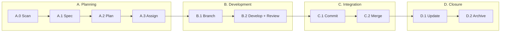

[English](README.md) | [中文](README.zh.md) | [日本語](README.ja.md) | **한국어**

<!-- translated-from: v1.56.1 -->

# Aria

> AI를 소프트웨어 프로젝트의 진정한 협력자로

[](https://opensource.org/licenses/MIT)
[](https://github.com/10CG/aria-plugin)

---

## Aria란?

Aria는 Claude Code와 같은 AI 어시스턴트가 구조화된 워크플로우를 통해 소프트웨어 개발 생명주기 전체에 깊이 참여할 수 있게 하는 **AI-DDD(AI-Assisted Domain-Driven Design) 방법론**입니다.

기존의 "AI가 코드를 작성하는" 도구와 달리, Aria는 **AI가 프로젝트의 의도를 이해하고 가치 있는 협력자가 되는 방법**에 초점을 맞춥니다.

| 기존 방식 | Aria 방식 |
|-----------------|-----------|
| AI는 도구다 — 당신이 묻고, AI가 답한다 | AI는 협력자다 — AI가 이해하고, 당신이 확인하고, 함께 전달한다 |

**Aria 2.0 (v2.0.0, 진행 중)** 은 이 방법론을 자율 실행으로 확장합니다. 2계층 아키텍처는 [docs/architecture/system-architecture.md](docs/architecture/system-architecture.md) 를 참고하세요.

---

## 왜 Aria인가?

### 문제

- AI의 제안이 프로젝트 컨벤션을 따르지 않는다
- 세션마다 프로젝트 컨텍스트를 다시 설명해야 한다
- 코드와 문서가 따로 논다
- 요구사항 변경에 대한 감사 추적이 없다

### 해결책

| 기능 | 설명 |
|---------|-------------|
| **상태 인식** | AI가 프로젝트를 자동으로 스캔하고 현재 진행 상황을 이해한다 |
| **스펙 우선 (Spec First)** | OpenSpec이 요구사항 기술을 표준화한다 |
| **십단계 사이클 (Ten-Step Cycle)** | 구조화된 AI 협업 워크플로우 |
| **문서 동기화 (Docs in Sync)** | 아키텍처 문서가 코드와 함께 진화한다 |
| **TDD 주도** | 강제 적용되는 테스트 우선 개발 |
| **협업적 사고** | AI가 참여하는 구조화된 브레인스토밍 |

로드맵과 자율 실행 비전은 [Aria 2.0 PRD](docs/requirements/prd-aria-v2.md) 를 참고하세요.

---

## 빠른 시작

### 사전 요구사항

- [Claude Code](https://claude.ai/code) 설치 및 인증 완료
- Git 2.x+ (standards 서브모듈 사용 시)

### Aria 플러그인 설치

```bash
# 마켓플레이스 추가
/plugin marketplace add 10CG/aria-plugin

# 설치 (Skills + Agents 포함)
/plugin install aria@10CG-aria-plugin
```

### Standards 설치 (선택 사항)

standards 서브모듈은 OpenSpec 요구사항 명세를 제공합니다. 스펙 주도 워크플로우가 필요 없다면 이 단계를 건너뛰어도 됩니다.

```bash
# HTTPS
git submodule add https://github.com/10CG/aria-standards.git standards

# 또는 SSH
git submodule add git@github.com:10CG/aria-standards.git standards
```

### 프로젝트 설정

템플릿에서 `.aria/config.json` 을 생성하거나, 그냥 바로 Aria를 사용하기 시작하세요:

```bash
# 프로젝트 상태 스캔
/aria:state-scanner

# 요구사항 명세 작성
/aria:spec-drafter

# 구조화된 브레인스토밍
/aria:brainstorm

# 전문 에이전트 호출
/aria:tech-lead Please plan the architecture for this feature
```

---

## 작동 방식: 십단계 사이클



각 단계마다 전용 Skill이 있어 일관되고 재현 가능한 워크플로우를 보장합니다:

| 단계 | 수행 내용 |
|-------|-------------|
| **A. 계획 (Planning)** | 프로젝트 상태 스캔 → 스펙 작성 → 작업 분해 → 에이전트 배정 |
| **B. 개발 (Development)** | 브랜치 생성 → TDD + 코드 리뷰로 개발 |
| **C. 통합 (Integration)** | 커밋 메시지 생성 → 메인으로 머지 |
| **D. 마무리 (Closure)** | 진행 상황 업데이트 → 스펙 아카이브 |

---

## 제공되는 것

### Skills (사용자용 35개 + 내부용 7개 = 총 42개)

| 분류 | Skills | 목적 |
|----------|--------|---------|
| **사이클 코어** | state-scanner, workflow-runner, phase-a-planner, phase-b-developer, phase-c-integrator, phase-d-closer, spec-drafter, task-planner, progress-updater | 구조화된 십단계 워크플로우 |
| **협업적 사고** | brainstorm | 구조화된 브레인스토밍 세션 |
| **Git 워크플로우** | commit-msg-generator, strategic-commit-orchestrator, branch-manager, branch-finisher | 커밋 및 브랜치 관리 |
| **개발 도구** | subagent-driver, tdd-enforcer, requesting-code-review | TDD 강제 적용, 코드 리뷰 |
| **아키텍처 문서** | arch-search, arch-update, arch-scaffolder, api-doc-generator | 문서를 코드와 동기화 유지 |
| **요구사항 & 이슈** | requirements-validator, requirements-sync, forgejo-sync, openspec-archive, issue-triage | 요구사항 추적 및 이슈 트리아지 |
| **프로젝트 적응** | project-analyzer, agent-gap-analyzer, agent-creator | 프로젝트 분석, Agent 공백 식별, 설정 생성 |
| **관찰성 & 추정** | aria-context-monitor, ai-native-estimator, aria-dashboard | 컨텍스트/토큰 텔레메트리, 작업량 추정, 진행 상황 시각화 |
| **피드백 & 진단** | aria-report, aria-doctor | 버그 리포트 및 환경 상태 점검 |
| **인프라** *(내부용 7개, 사용자 직접 호출 불가)* | config-loader, audit-engine, agent-team-audit, agent-router, arch-common, git-remote-helper, aria-token-telemetry | 설정, 감사 오케스트레이션, 작업 라우팅, 공유 인프라 |

### Agents (11개)

| Agent | 역할 |
|-------|------|
| tech-lead | 기술 의사결정 및 아키텍처 계획 |
| context-manager | 에이전트 간 컨텍스트 관리 |
| knowledge-manager | 지식 베이스 관리 |
| code-reviewer | 코드 리뷰 |
| backend-architect | 백엔드 아키텍처 설계 |
| mobile-developer | 모바일 개발 |
| qa-engineer | 품질 보증 |
| ai-engineer | AI/LLM 애플리케이션 개발 |
| api-documenter | API 문서화 |
| ui-ux-designer | 인터페이스 디자인 |
| legal-advisor | 법률 및 규정 준수 문서 |

---

## 활용 사례

| 시나리오 | Aria가 돕는 방식 |
|----------|---------------|
| 신규 기능 | 요구사항부터 코드까지 엔드투엔드 흐름 |
| 버그 수정 | TDD 주도 수정 워크플로우 |
| 리팩터링 | 아키텍처 문서와 동기화된 코드 진화 |
| 코드 리뷰 | 자동화된 컨벤션 준수 점검 |
| 지식 전수 | 신규 인원이 프로젝트를 빠르게 이해하도록 지원 |
| 기술 의사결정 | 구조화된 브레인스토밍 및 솔루션 설계 |

---

## OpenSpec: 요구사항 명세

AI와 사람이 "무엇을 만들지"에 합의하도록 요구사항을 기술하는 표준화된 형식입니다:

| 레벨 | 사용 시점 | 산출물 |
|-------|-------------|--------|
| 1 (Skip) | 간단한 수정 | 스펙 불필요 |
| 2 (Minimal) | 중간 규모 기능 | `proposal.md` |
| 3 (Full) | 아키텍처 변경 | `proposal.md` + `tasks.md` |

Aria 플러그인은 프로젝트 루트 디렉터리의 `openspec/changes/` 에서 스펙을 읽습니다 (`standards/` 내부가 아님). `standards` 서브모듈은 플러그인이 참조하는 방법론 정의를 제공합니다.

---

## 프로젝트 구조

**당신의 프로젝트** (Aria 도입 후):

```
your-project/
├── .aria/
│   └── config.json            # 프로젝트 설정
├── openspec/
│   └── changes/                # 당신의 요구사항 명세가 여기에 위치
├── standards/                  # (선택) 방법론 명세 서브모듈
├── docs/                       # (권장) 아키텍처 문서
│   └── architecture/           # 코드와 동기화 유지
└── [당신의 코드...]
```

**Aria 저장소** (이 저장소):

```
Aria/
├── README.md                   # 이 문서
├── CLAUDE.md                   # AI 프로젝트 컨텍스트
├── VERSION                     # 버전 정보
├── LICENSE                     # MIT License
├── standards/                  # 방법론 명세 (서브모듈)
│   ├── core/                   # 핵심 정의 (십단계 사이클)
│   ├── openspec/               # 요구사항 명세 형식
│   └── conventions/            # 컨벤션 (git commit 등)
├── aria/                       # Aria 플러그인 (서브모듈)
│   ├── skills/                 # Skills 42개 (사용자용 35개 + 내부용 7개)
│   ├── agents/                 # Agents 11개 (STCO 설명 + capabilities 포함)
│   └── .claude-plugin/         # 플러그인 설정
├── aria-plugin-benchmarks/     # Skill 벤치마크 스위트
│   ├── ab-suite/               # AB 테스트 픽스처
│   └── ab-results/             # AB 테스트 결과 아카이브
├── docs/                       # 연구 문서
│   ├── architecture/           # 시스템 아키텍처
│   └── requirements/           # PRD + User Stories
├── tests/                      # 테스트 파일
└── openspec/                   # Aria 자체 OpenSpec 변경
    └── archive/                # 완료된 변경 아카이브
```

---

## 프로젝트 상태

```
Project Version:  1.7.3
Plugin Version:   1.56.1 (aria-plugin, 42 Skills + 11 Agents)
Maturity:         Core workflows verified + project adaptation
PRD v2.0:        Approved (AI autonomous development)
Research Focus:   Reproducibility of AI collaboration patterns
```

---

## 기여하기

기여와 토론을 환영합니다!

1. 이 저장소를 포크합니다
2. 브랜치를 생성합니다 (`git checkout -b feature/your-feature`)
3. 십단계 사이클 워크플로우를 따릅니다
4. Pull Request를 제출합니다

---

## 라이선스

MIT License — [LICENSE](LICENSE) 참조

---

## 연락처

- **저장소**: https://github.com/10CG/Aria
- **플러그인**: https://github.com/10CG/aria-plugin
- **Standards**: https://github.com/10CG/aria-standards
- **이메일**: help@10cg.pub
- **관리자**: 10CG Lab
