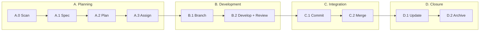

**English** | [中文](README.zh.md) | [日本語](README.ja.md) | [한국어](README.ko.md)

# Aria

> Make AI a genuine collaborator in your software projects

[](https://opensource.org/licenses/MIT)
[](https://github.com/10CG/aria-plugin)

---

## What is Aria?

Aria is an **AI-DDD (AI-Assisted Domain-Driven Design) methodology** that enables AI assistants like Claude Code to deeply participate in the entire software development lifecycle through structured workflows.

Unlike traditional "AI writes code" tools, Aria focuses on: **how to make AI understand project intent and become a valuable collaborator**.

| Traditional Mode | Aria Mode |
|-----------------|-----------|
| AI is a tool — you ask, AI answers | AI is a collaborator — AI understands, you confirm, you deliver together |

---

## Why Aria?

### The Problem

- AI suggestions don't follow your project conventions
- You re-explain project context every session
- Code and documentation drift apart
- Requirement changes have no audit trail

### The Solution

| Feature | Description |
|---------|-------------|
| **State Awareness** | AI automatically scans your project and understands current progress |
| **Spec First** | OpenSpec standardizes requirement descriptions |
| **Ten-Step Cycle** | Structured AI collaboration workflow |
| **Docs in Sync** | Architecture docs evolve with your code |
| **TDD Driven** | Test-first development with enforcement |
| **Collaborative Thinking** | Structured brainstorming with AI participation |

---

## Quick Start

### Prerequisites

- [Claude Code](https://claude.ai/code) installed and authenticated
- Git 2.x+ (if using the standards submodule)

### Install the Aria Plugin

```bash
# Add marketplace
/plugin marketplace add 10CG/aria-plugin

# Install (Skills + Agents included)
/plugin install aria@10CG-aria-plugin
```

### Install Standards (Optional)

The standards submodule provides OpenSpec requirement specifications. Skip this if you don't need spec-driven workflows.

```bash
# HTTPS
git submodule add https://github.com/10CG/aria-standards.git standards

# Or SSH
git submodule add git@github.com:10CG/aria-standards.git standards
```

### Configure Your Project

Create `.aria/config.json` from the template, or simply start using Aria:

```bash
# Scan project status
/aria:state-scanner

# Create a requirement spec
/aria:spec-drafter

# Structured brainstorming
/aria:brainstorm

# Call a specialized agent
/aria:tech-lead Please plan the architecture for this feature
```

---

## How It Works: The Ten-Step Cycle



Each phase has a dedicated Skill that ensures consistent, repeatable workflows:

| Phase | What Happens |
|-------|-------------|
| **A. Planning** | Scan project state → Create spec → Break down tasks → Assign agents |
| **B. Development** | Create branch → Develop with TDD + code review |
| **C. Integration** | Generate commit message → Merge to main |
| **D. Closure** | Update progress → Archive spec |

---

## What You Get

### Skills (30 user-facing + 3 internal)

| Category | Skills | Purpose |
|----------|--------|---------|
| **Cycle Core** | state-scanner, workflow-runner, phase-a-planner, phase-b-developer, phase-c-integrator, phase-d-closer, spec-drafter, task-planner, progress-updater | Structured ten-step workflow |
| **Collaborative Thinking** | brainstorm | Structured brainstorming sessions |
| **Git Workflow** | commit-msg-generator, strategic-commit-orchestrator, branch-manager, branch-finisher | Commit and branch management |
| **Dev Tools** | subagent-driver, agent-router, tdd-enforcer, requesting-code-review | TDD enforcement, code review |
| **Architecture Docs** | arch-common, arch-search, arch-update, arch-scaffolder, api-doc-generator | Keep docs in sync with code |
| **Requirements** | requirements-validator, requirements-sync, forgejo-sync, openspec-archive | Requirement tracking |
| **Feedback** | aria-report | Bug reports and feature requests |
| **Dashboard** | aria-dashboard | Project progress visualization |
| **Infrastructure** | config-loader, audit-engine, agent-team-audit *(internal)* | Configuration, audit orchestration |

### Agents (11)

| Agent | Role |
|-------|------|
| tech-lead | Technical decisions and architecture planning |
| context-manager | Cross-agent context management |
| knowledge-manager | Knowledge base management |
| code-reviewer | Code review |
| backend-architect | Backend architecture design |
| mobile-developer | Mobile development |
| qa-engineer | Quality assurance |
| ai-engineer | AI/LLM application development |
| api-documenter | API documentation |
| ui-ux-designer | Interface design |
| legal-advisor | Legal and compliance documentation |

---

## Use Cases

| Scenario | How Aria Helps |
|----------|---------------|
| New Feature | End-to-end flow from requirements to code |
| Bug Fix | TDD-driven fix workflow |
| Refactoring | Code evolution with architecture docs in sync |
| Code Review | Automated convention compliance checks |
| Knowledge Transfer | Help newcomers understand a project quickly |
| Technical Decisions | Structured brainstorming and solution design |

---

## OpenSpec: Requirement Specifications

A standardized format for describing requirements so AI and humans agree on "what to build":

| Level | When to Use | Output |
|-------|-------------|--------|
| 1 (Skip) | Simple fixes | No spec needed |
| 2 (Minimal) | Medium features | `proposal.md` |
| 3 (Full) | Architecture changes | `proposal.md` + `tasks.md` |

Aria plugin reads specs from `openspec/changes/` in your project root directory (not inside `standards/`). The `standards` submodule provides the methodology definitions that the plugin references.

---

## Project Structure

**Your project** (after adopting Aria):

```
your-project/
├── .aria/
│   └── config.json            # Project configuration
├── openspec/
│   └── changes/                # Your requirement specs go here
├── standards/                  # (Optional) Methodology specs submodule
├── docs/                       # (Recommended) Architecture docs
│   └── architecture/           # Kept in sync with code
└── [your code...]
```

**Aria repository** (this repo):

```
Aria/
├── README.md                   # This document
├── CLAUDE.md                   # AI project context
├── VERSION                     # Version info
├── LICENSE                     # MIT License
├── standards/                  # Methodology specs (submodule)
│   ├── core/                   # Core definitions (ten-step cycle)
│   ├── openspec/               # Requirement spec format
│   └── conventions/            # Conventions (git commit, etc.)
├── aria/                       # Aria Plugin (submodule, v1.11.1)
│   ├── skills/                 # 33 Skills (30 user-facing + 3 internal)
│   ├── agents/                 # 11 Agents
│   └── .claude-plugin/         # Plugin configuration
├── aria-plugin-benchmarks/     # Skill benchmark suite
│   ├── ab-suite/               # AB test fixtures
│   └── ab-results/             # AB test result archives
├── docs/                       # Research documentation
│   ├── architecture/           # System architecture
│   └── requirements/           # PRD + User Stories
├── tests/                      # Test files
└── openspec/                   # Aria's own OpenSpec changes
    └── archive/                # Completed change archives
```

---

## Project Status

```
Project Version:  1.4.2
Plugin Version:   1.11.1 (aria-plugin)
Maturity:         Core workflows verified
Research Focus:   Reproducibility of AI collaboration patterns
```

---

## Contributing

Contributions and discussions are welcome!

1. Fork this repository
2. Create your branch (`git checkout -b feature/your-feature`)
3. Follow the ten-step cycle workflow
4. Submit a Pull Request

---

## License

MIT License — see [LICENSE](LICENSE)

---

## Contact

- **Repository**: https://github.com/10CG/Aria
- **Plugin**: https://github.com/10CG/aria-plugin
- **Standards**: https://github.com/10CG/aria-standards
- **Email**: help@10cg.pub
- **Maintainer**: 10CG Lab
