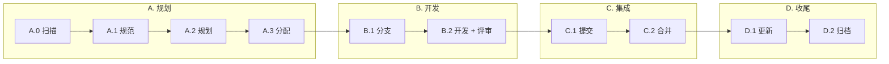

[English](README.md) | **中文** | [日本語](README.ja.md) | [한국어](README.ko.md)

# Aria

> 让 AI 真正理解你的软件项目

[](https://opensource.org/licenses/MIT)
[](https://github.com/10CG/aria-plugin)

---

## 什么是 Aria？

Aria 是一套 **AI-DDD (AI 辅助领域驱动设计) 方法论**，通过结构化的工作流让 Claude Code 这样的 AI 助手深度参与软件开发全过程。

与传统"AI 写代码"工具不同，Aria 关注的是：**如何让 AI 理解项目意图，成为有价值的协作者**。

| 传统模式 | Aria 模式 |
|---------|----------|
| AI 是工具 — 你问，AI 答 | AI 是协作者 — AI 理解，你确认，共同交付 |

---

## 为什么需要 Aria？

### 问题

- AI 给的建议不符合项目规范
- 每次都要重新解释项目背景
- 代码和文档不同步
- 需求变更没有追溯记录

### 解决方案

| 特性 | 说明 |
|------|------|
| **状态感知** | AI 自动扫描项目，理解当前进度 |
| **规范先行** | OpenSpec 标准化需求描述 |
| **十步循环** | 结构化的 AI 协作工作流 |
| **文档同步** | 架构文档与代码共同演进 |
| **TDD 驱动** | 测试先行，质量可控 |
| **协作思考** | 结构化头脑风暴，AI 参与决策 |

---

## 快速开始

### 前置条件

- [Claude Code](https://claude.ai/code) 已安装并完成登录
- Git 2.x+（若需要 standards 子模块）

### 安装 Aria 插件

```bash
# 添加 marketplace
/plugin marketplace add 10CG/aria-plugin

# 安装 (Skills + Agents 一起安装)
/plugin install aria@10CG-aria-plugin
```

### 安装 Standards（可选）

Standards 子模块提供 OpenSpec 需求规范。如果不需要规范驱动的工作流，可以跳过此步骤。

```bash
# HTTPS
git submodule add https://github.com/10CG/aria-standards.git standards

# 或使用 SSH
git submodule add git@github.com:10CG/aria-standards.git standards
```

### 配置项目

从模板创建 `.aria/config.json`，或直接开始使用 Aria：

```bash
# 扫描项目状态
/aria:state-scanner

# 创建需求规范
/aria:spec-drafter

# 结构化头脑风暴
/aria:brainstorm

# 调用专业 Agent
/aria:tech-lead 请规划这个功能的架构
```

---

## 工作原理：十步循环



每个阶段都有对应的 Skill，确保流程标准化、可重复：

| 阶段 | 执行内容 |
|------|---------|
| **A. 规划** | 扫描项目状态 → 创建规范 → 分解任务 → 分配 Agent |
| **B. 开发** | 创建分支 → TDD 开发 + 代码评审 |
| **C. 集成** | 生成提交消息 → 合并到主干 |
| **D. 收尾** | 更新进度 → 归档规范 |

---

## 组件概览

### Skills（27 个面向用户 + 2 个内部）

| 类别 | Skills | 用途 |
|------|--------|------|
| **循环核心** | state-scanner, workflow-runner, phase-a-planner, phase-b-developer, phase-c-integrator, phase-d-closer, spec-drafter, task-planner, progress-updater | 结构化十步工作流 |
| **协作思考** | brainstorm | 结构化头脑风暴 |
| **Git 工作流** | commit-msg-generator, strategic-commit-orchestrator, branch-manager, branch-finisher | 提交与分支管理 |
| **开发工具** | subagent-driver, agent-router, tdd-enforcer, requesting-code-review | TDD 强制、代码审查 |
| **架构文档** | arch-common, arch-search, arch-update, arch-scaffolder, api-doc-generator | 架构文档与代码同步 |
| **需求管理** | requirements-validator, requirements-sync, forgejo-sync, openspec-archive | 需求追踪 |
| **基础设施** | config-loader *（内部）* | 配置加载 |
| **实验功能** | agent-team-audit *（默认关闭）* | 多 Agent 团队审计 |

### Agents（11 个）

| Agent | 职责 |
|-------|------|
| tech-lead | 技术决策与架构规划 |
| context-manager | 跨 Agent 上下文管理 |
| knowledge-manager | 知识库管理 |
| code-reviewer | 代码审查 |
| backend-architect | 后端架构设计 |
| mobile-developer | 移动端开发 |
| qa-engineer | 质量保证 |
| ai-engineer | AI/LLM 应用开发 |
| api-documenter | API 文档生成 |
| ui-ux-designer | 界面设计 |
| legal-advisor | 法律合规文档 |

---

## 适用场景

| 场景 | Aria 帮助你 |
|------|-------------|
| 新功能开发 | 从需求到代码的完整流程 |
| Bug 修复 | TDD 驱动的修复流程 |
| 重构 | 架构文档同步的代码演进 |
| 代码审查 | 规范合规性自动检查 |
| 知识传递 | 新人快速理解项目 |
| 技术决策 | 结构化头脑风暴与方案讨论 |

---

## OpenSpec 需求规范

标准化的需求描述格式，让 AI 和人类对"做什么"达成共识：

| Level | 适用场景 | 产物 |
|-------|----------|------|
| 1 (Skip) | 简单修复 | 无需规范 |
| 2 (Minimal) | 中等功能 | `proposal.md` |
| 3 (Full) | 架构变更 | `proposal.md` + `tasks.md` |

Aria 插件从项目根目录的 `openspec/changes/` 读取规范（不是 `standards/` 内部）。`standards` 子模块提供方法论定义供插件引用。

---

## 项目结构

**你的项目**（使用 Aria 后）：

```
your-project/
├── .aria/
│   └── config.json            # 项目配置
├── openspec/
│   └── changes/                # 项目需求规范存放处
├── standards/                  # （可选）方法论规范子模块
├── docs/                       # （推荐）架构文档
│   └── architecture/           # 与代码同步的架构设计
└── [你的代码...]
```

**Aria 仓库**（本项目）：

```
Aria/
├── README.md                   # 英文文档
├── README.zh.md                # 本文档（中文）
├── CLAUDE.md                   # AI 项目上下文
├── VERSION                     # 版本信息
├── LICENSE                     # MIT 许可证
├── standards/                  # 方法论规范（子模块）
│   ├── core/                   # 核心定义（十步循环、进度管理）
│   ├── openspec/               # 需求规范格式
│   └── conventions/            # 约定规范（Git Commit 等）
├── aria/                       # Aria 插件（子模块, v1.10.0）
│   ├── skills/                 # 33 个 Skills（30 个面向用户 + 3 个内部）
│   ├── agents/                 # 11 个 Agents
│   └── .claude-plugin/         # Plugin 配置
├── aria-plugin-benchmarks/     # Skill 基准测试套件
│   ├── ab-suite/               # AB 测试固定测试集
│   └── ab-results/             # AB 测试结果存档
├── docs/                       # 研究文档
│   ├── architecture/           # 系统架构文档
│   └── requirements/           # PRD + User Stories
├── tests/                      # 测试文件
└── openspec/                   # Aria 自身的 OpenSpec 变更
    └── archive/                # 已完成的变更归档
```

---

## 项目状态

```
主项目版本:  1.3.0
插件版本:    1.10.0 (aria-plugin)
成熟度:      核心流程已验证
研究方向:    AI 协作模式的可重现性
```

---

## 贡献指南

欢迎讨论和改进！

1. Fork 本项目
2. 创建你的分支 (`git checkout -b feature/your-feature`)
3. 遵循十步循环流程
4. 提交 Pull Request

---

## 许可证

MIT License — 详见 [LICENSE](LICENSE)

---

## 联系方式

- **项目主页**: https://github.com/10CG/Aria
- **插件仓库**: https://github.com/10CG/aria-plugin
- **规范仓库**: https://github.com/10CG/aria-standards
- **联系邮箱**: help@10cg.pub
- **维护**: 10CG Lab
