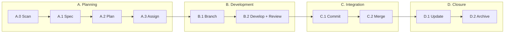

[English](README.md) | **中文** | [日本語](README.ja.md) | [한국어](README.ko.md)

<!-- translated-from: v1.49.0 -->

# Aria

> 让 AI 成为你软件项目中真正的协作者

[](https://opensource.org/licenses/MIT)
[](https://github.com/10CG/aria-plugin)

---

## 什么是 Aria?

Aria 是一套 **AI-DDD (AI 辅助领域驱动设计) 方法论**, 它让 Claude Code 这样的 AI 助手通过结构化工作流深度参与整个软件开发生命周期。

与传统的 "AI 写代码" 工具不同, Aria 聚焦于: **如何让 AI 理解项目意图, 成为有价值的协作者**。

| 传统模式 | Aria 模式 |
|-----------------|-----------|
| AI 是工具 —— 你提问, AI 回答 | AI 是协作者 —— AI 理解, 你确认, 你们共同交付 |

**Aria 2.0 (v2.0.0, 进行中)** 把方法论延伸到自主执行。两层架构详见 [docs/architecture/system-architecture.md](docs/architecture/system-architecture.md)。

---

## 为什么选择 Aria?

### 痛点

- AI 的建议不遵循你的项目约定
- 每个 session 都要重新解释项目上下文
- 代码和文档逐渐脱节
- 需求变更没有可追溯的记录

### 解决方案

| 特性 | 说明 |
|---------|-------------|
| **状态感知** | AI 自动扫描你的项目并理解当前进度 |
| **规范先行** | OpenSpec 标准化需求描述 |
| **十步循环** | 结构化的 AI 协作工作流 |
| **文档同步** | 架构文档与你的代码同步演进 |
| **TDD 驱动** | 强制执行的测试先行开发 |
| **协作思考** | 有 AI 参与的结构化头脑风暴 |

路线图与自主执行愿景详见 [Aria 2.0 PRD](docs/requirements/prd-aria-v2.md)。

---

## 快速开始

### 前置条件

- 已安装并完成认证的 [Claude Code](https://claude.ai/code)
- Git 2.x+ (如果使用 standards 子模块)

### 安装 Aria 插件

```bash
# Add marketplace
/plugin marketplace add 10CG/aria-plugin

# Install (Skills + Agents included)
/plugin install aria@10CG-aria-plugin
```

### 安装 Standards (可选)

standards 子模块提供 OpenSpec 需求规范。如果你不需要规范驱动的工作流, 可以跳过这一步。

```bash
# HTTPS
git submodule add https://github.com/10CG/aria-standards.git standards

# Or SSH
git submodule add git@github.com:10CG/aria-standards.git standards
```

### 配置你的项目

从模板创建 `.aria/config.json`, 或者直接开始使用 Aria:

```bash
# Scan project status
/aria:state-scanner

# Create a requirement spec
/aria:spec-drafter

# Structured brainstorming
/aria:brainstorm

# Call a specialized agent
/aria:tech-lead Please plan the architecture for this feature
```

---

## 工作原理: 十步循环


```mermaid
flowchart LR
    subgraph A["A. Planning"]
        A0[A.0 Scan] --> A1[A.1 Spec] --> A2[A.2 Plan] --> A3[A.3 Assign]
    end
    subgraph B["B. Development"]
        B1[B.1 Branch] --> B2[B.2 Develop + Review]
    end
    subgraph C["C. Integration"]
        C1[C.1 Commit] --> C2[C.2 Merge]
    end
    subgraph D["D. Closure"]
        D1[D.1 Update] --> D2[D.2 Archive]
    end
    A3 --> B1
    B2 --> C1
    C2 --> D1
```

每个阶段都有专属的 Skill, 确保工作流一致、可重复:

| 阶段 | 发生了什么 |
|-------|-------------|
| **A. 规划** | 扫描项目状态 → 创建规范 → 分解任务 → 分配 Agent |
| **B. 开发** | 创建分支 → 以 TDD + 代码评审进行开发 |
| **C. 集成** | 生成 commit message → 合并到主干 |
| **D. 收尾** | 更新进度 → 归档规范 |

---

## 你能得到什么

### Skills (34 个面向用户 + 7 个内部 = 41 个总计)

| 分类 | Skills | 用途 |
|----------|--------|---------|
| **循环核心** | state-scanner, workflow-runner, phase-a-planner, phase-b-developer, phase-c-integrator, phase-d-closer, spec-drafter, task-planner, progress-updater | 结构化的十步工作流 |
| **协作思考** | brainstorm | 结构化的头脑风暴会话 |
| **Git 工作流** | commit-msg-generator, strategic-commit-orchestrator, branch-manager, branch-finisher | 提交与分支管理 |
| **开发工具** | subagent-driver, tdd-enforcer, requesting-code-review | TDD 强制执行、代码评审 |
| **架构文档** | arch-search, arch-update, arch-scaffolder, api-doc-generator | 保持文档与代码同步 |
| **需求与 Issue** | requirements-validator, requirements-sync, forgejo-sync, openspec-archive, issue-triage | 需求跟踪与 issue triage |
| **项目适配** | project-analyzer, agent-gap-analyzer, agent-creator | 分析项目、识别 Agent 缺口、生成配置 |
| **可观测性与估算** | aria-context-monitor, ai-native-estimator, aria-dashboard | Context/token 遥测、工作量估算、进度可视化 |
| **反馈与诊断** | aria-report, aria-doctor | Bug 报告与环境健康检查 |
| **基础设施** *(7 个内部, 不可由用户调用)* | config-loader, audit-engine, agent-team-audit, agent-router, arch-common, git-remote-helper, aria-token-telemetry | 配置、审计编排、任务路由、共享基础设施 |

### Agents (11 个)

| Agent | 角色 |
|-------|------|
| tech-lead | 技术决策与架构规划 |
| context-manager | 跨 Agent 上下文管理 |
| knowledge-manager | 知识库管理 |
| code-reviewer | 代码评审 |
| backend-architect | 后端架构设计 |
| mobile-developer | 移动端开发 |
| qa-engineer | 质量保证 |
| ai-engineer | AI/LLM 应用开发 |
| api-documenter | API 文档 |
| ui-ux-designer | 界面设计 |
| legal-advisor | 法务与合规文档 |

---

## 使用场景

| 场景 | Aria 如何帮助 |
|----------|---------------|
| 新功能 | 从需求到代码的端到端流程 |
| Bug 修复 | TDD 驱动的修复工作流 |
| 重构 | 架构文档同步的代码演进 |
| 代码评审 | 自动化的约定合规检查 |
| 知识传递 | 帮助新人快速理解项目 |
| 技术决策 | 结构化的头脑风暴与方案设计 |

---

## OpenSpec: 需求规范

一种标准化的需求描述格式, 让 AI 和人类对 "做什么" 达成共识:

| 级别 | 何时使用 | 产出 |
|-------|-------------|--------|
| 1 (Skip) | 简单修复 | 无需规范 |
| 2 (Minimal) | 中等功能 | `proposal.md` |
| 3 (Full) | 架构变更 | `proposal.md` + `tasks.md` |

Aria 插件从你项目根目录下的 `openspec/changes/` 读取规范 (而不是 `standards/` 内部)。`standards` 子模块提供插件所引用的方法论定义。

---

## 项目结构

**你的项目** (采用 Aria 之后):

```
your-project/
├── .aria/
│   └── config.json            # 项目配置
├── openspec/
│   └── changes/                # 你的需求规范放这里
├── standards/                  # (可选) 方法论规范子模块
├── docs/                       # (推荐) 架构文档
│   └── architecture/           # 与代码保持同步
└── [your code...]
```

**Aria 仓库** (本仓库):

```
Aria/
├── README.md                   # 本文档
├── CLAUDE.md                   # AI 项目上下文
├── VERSION                     # 版本信息
├── LICENSE                     # MIT License
├── standards/                  # 方法论规范 (子模块)
│   ├── core/                   # 核心定义 (十步循环)
│   ├── openspec/               # 需求规范格式
│   └── conventions/            # 约定 (git commit 等)
├── aria/                       # Aria 插件 (子模块)
│   ├── skills/                 # 41 个 Skills (34 个面向用户 + 7 个内部)
│   ├── agents/                 # 11 个 Agents (带 STCO 描述 + capabilities)
│   └── .claude-plugin/         # 插件配置
├── aria-plugin-benchmarks/     # Skill 基准测试套件
│   ├── ab-suite/               # AB 测试固定用例
│   └── ab-results/             # AB 测试结果存档
├── docs/                       # 研究文档
│   ├── architecture/           # 系统架构
│   └── requirements/           # PRD + User Stories
├── tests/                      # 测试文件
└── openspec/                   # Aria 自身的 OpenSpec 变更
    └── archive/                # 已完成变更的存档
```

---

## 项目状态

```
Project Version:  1.7.0
Plugin Version:   1.49.0 (aria-plugin, 41 Skills + 11 Agents)
Maturity:         Core workflows verified + project adaptation
PRD v2.0:        Approved (AI autonomous development)
Research Focus:   Reproducibility of AI collaboration patterns
```

---

## 贡献

欢迎贡献与讨论!

1. Fork 本仓库
2. 创建你的分支 (`git checkout -b feature/your-feature`)
3. 遵循十步循环工作流
4. 提交 Pull Request

---

## 许可证

MIT License —— 详见 [LICENSE](LICENSE)

---

## 联系方式

- **仓库**: https://github.com/10CG/Aria
- **插件**: https://github.com/10CG/aria-plugin
- **Standards**: https://github.com/10CG/aria-standards
- **邮箱**: help@10cg.pub
- **维护者**: 10CG Lab
